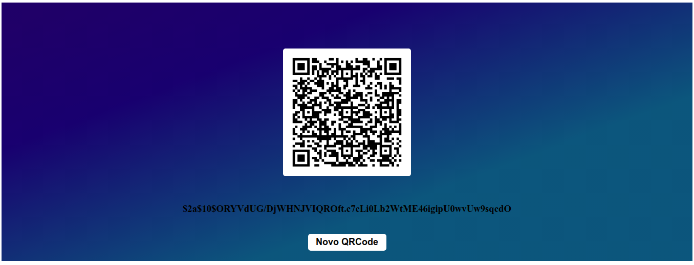

## DESAFIO - GERAÇÃO DE QR CODE

### Descrição do desafio: 
Desenvolver uma aplicação utilizando as tecnologias ReactJS + NodeJS com o framework express que seja capaz de coletar os dados.

**A aplicação web deverá receber os seguintes dados de entrada:** 

- Nome de Empresa
- CNPJ
- Valor

**1** - Por meio do recebimento destas informações deverá ser gerado uma string contendo as informações obtidas no input;

**2** - A string deve ser enviada a um endpoint via método POST;

**3** - O endpoint deve codificar a string recebida, será necessário a utilização de uma biblioteca que permita codificar a string passada (sugestão: bcrypt);

**4** - A resposta da chamada deve ser a string codificada;

**5** - Utilizando a resposta da chamada a api deve ser mostrado em tela um qr code gerado a partir da string codificada (sugestão: qrcode.react);

##### Sugestão de Biblioteca para codificação da string

https://github.com/kelektiv/node.bcrypt.js

##### Sugestão de Biblioteca para geração do Qr code

https://github.com/zpao/qrcode.react

### Como rodar a solução: 
Para o Front utilize o repositório [DesafioQrcode_frontend](https://github.com/DesafioQrcode/DesafioQrcode_frontend). Após clona-lo em sua máquina, utilize os seguintes comandos:

- Para instalar as dependencias `yarn` ou `npm install`
- Para rodar em modo desenvolvimento `yarn start` ou `npm start`

Para o Back utilize o repositório [DesafioQrcode_backend](https://github.com/DesafioQrcode/DesafioQrcode_backend). Após clona-lo em sua máquina, utilize os seguintes comandos:

- Para instalar as dependencias `yarn` ou `npm install`
- Para rodar em modo desenvolvimento `yarn dev:server` ou `npm run dev:server`

### Da solução: 
Agora que os dois ambientes estão rodando simultanêamente é possivel acessar o endereço [`http://localhost:3000/`](http://localhost:3000/)

Serãom exibidas as seguintes telas:

Campos para captação de dados do usuário:

Campos após a captação dos dados do usuário:

Qrcode gerado a partir das informações inseridas e seu respectivo valor para validação ao realizar a leitura do qrcode:

